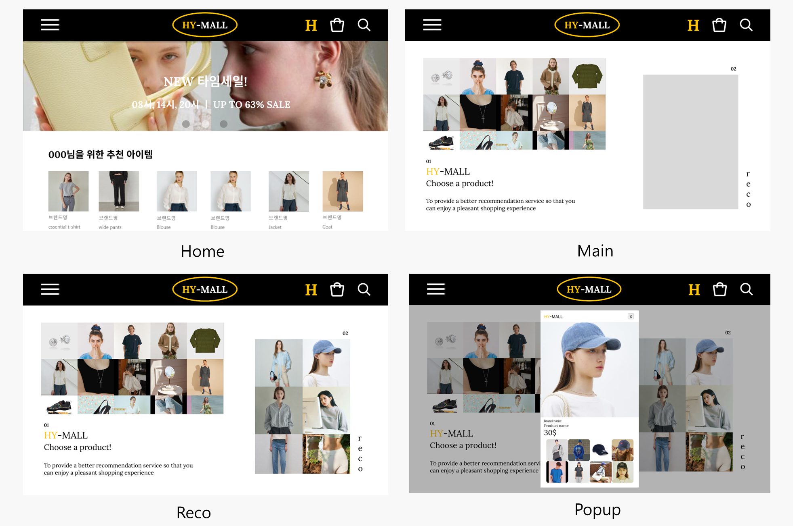

# 머신러닝을 이용한 이미지기반 상품 추천 시스템
## 개요
pytorch를 이용하여 상품 추천 시스템을 만드는 프로젝트입니다. 두가지 추천시스템을 제작하였습니다. 하나는 사용자의 로그데이터를 기반으로한 추천시스템, 다른 하나는 상품 이미지를 기반으로한 추천시스템입니다. 

## 프로젝트 세부사항
이미지 기반 추천시스템은 상품 이미지를 CGD모델에 넣은 특징 벡터를 사용하고 로그데이터 기반 시스템은 팩토라이제이션 머신을 사용합니다. 추출된 모델은 엘라스틱 서치에 업로드하여 사용합니다.  
CGD모델에 대한 설명은 해당 아래 논문을 확인해주세요.  
https://arxiv.org/pdf/1903.10663v4.pdf  

### 이미지 추천 모델 학습용 데이터 셋
홍콩대에서 공개한 같은 옷들을 여러 장 찍은 데이터 셋을 사용하여 학습하였습니다.
http://mmlab.ie.cuhk.edu.hk/projects/DeepFashion/InShopRetrieval.html

### 엘라스틱 서치 구조
|id|이미지 이름|로그추천벡터|이미지추천벡터|
|---|---|---|---|
|1|image1|reco[1024]|retrieval[1024]|
|2|image2|reco[1024]|retrieval[1024]|
|...|...|...|...|
---
위와 같은 형태로 엘라스틱 서치를 구성하였지만 추후에 가격, 이름등 상품 정보를 추가하여 엘라스틱 서치가 데이터베이스의 역할을 할 수 있도록 하였습니다.
### 백엔드 
백엔드로 python + fast-api를 사용하였습니다. 상품 선택 로그를 전달받아 reco(로그추천)벡터들의 코사인 유사도를 확인하여 상위 n개의 상품 정보를 반환하는 api와 선택된 상품 id를 전달 받아 retrival(이미지 추천)벡터들의 코사인 유사도를 확인하여 상위 n개의 상품 정보를 반환하는 api를 구현하여 사용하였습니다.

## 프로젝트 결과

https://youtu.be/r5S0Mri6Pjs?si=bZPYx8XneDDK2QSG
* home : **초기화면**, H버튼을 통해 추천 시스템 테스트 페이지로 들어갈 수 있습니다.
* main : **추천 시스템 테스트 화면**, 왼쪽에 랜덤으로 선택된 상품의 이미지들을 보여줍니다.
* reco : **로그기반 추천 결과**, 최대 n개의 최근 선택 기록에 따른 추천 상품들을 보여줍니다. 
* popup : **이미지 추천 결과**, 선택한 상품과 그에 따른 유사한 이미지를 갖는 상품들을 보여줍니다.

